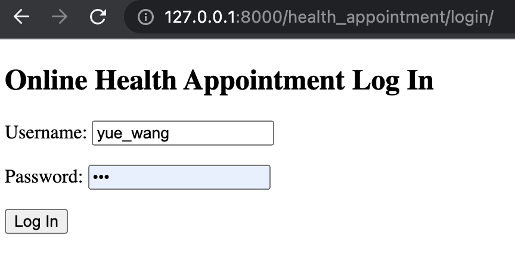
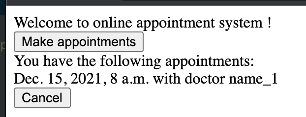
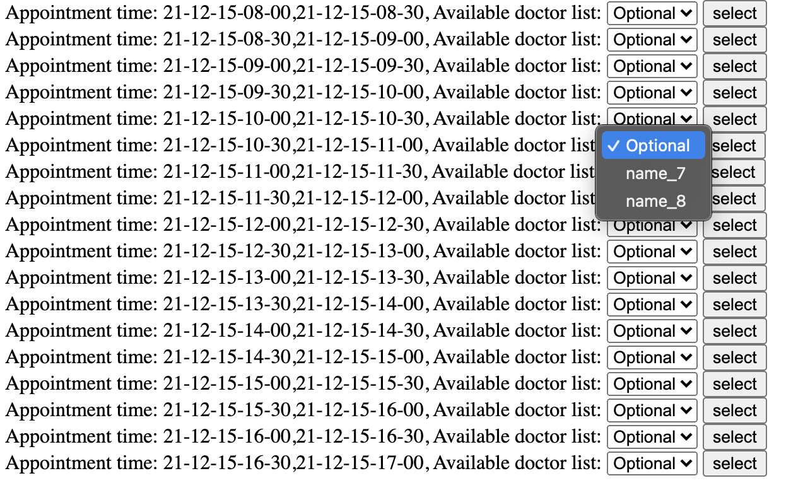

# ECE567 Final Project: Online Appointment System

This project is the implementation for ECE567 final project.

Python version=3.9

Please install required Python packages.

```
pip install -r requirements.txt
```

Launch Django server, under the main folder:

```
python manage.py runserver
```

In your browser, go to:
http://127.0.0.1:8000/health_appointment/login/

Please log in with the following username and password: 

```
user name: patient_1
password: 123
```
Login page


View upcoming appointments and make appointments


Check available appointments
